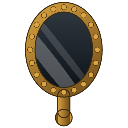
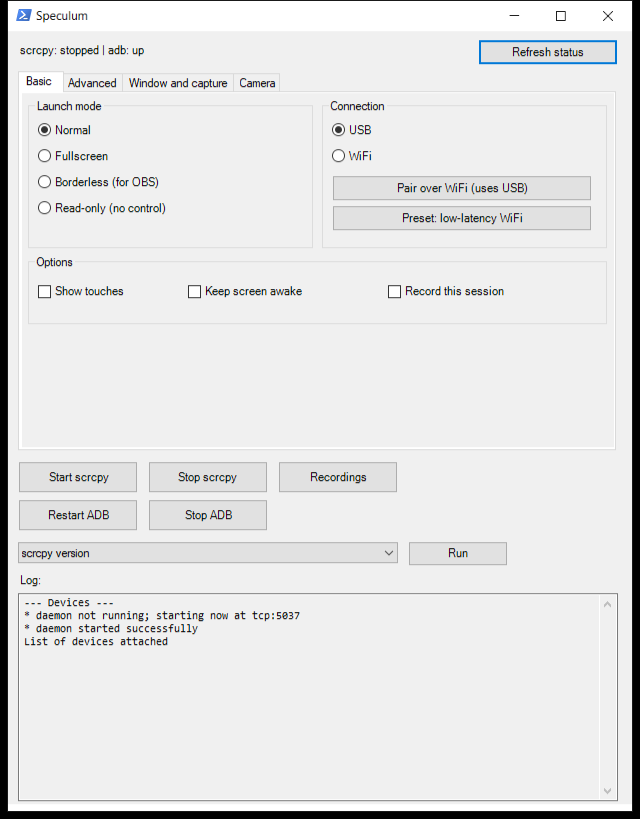
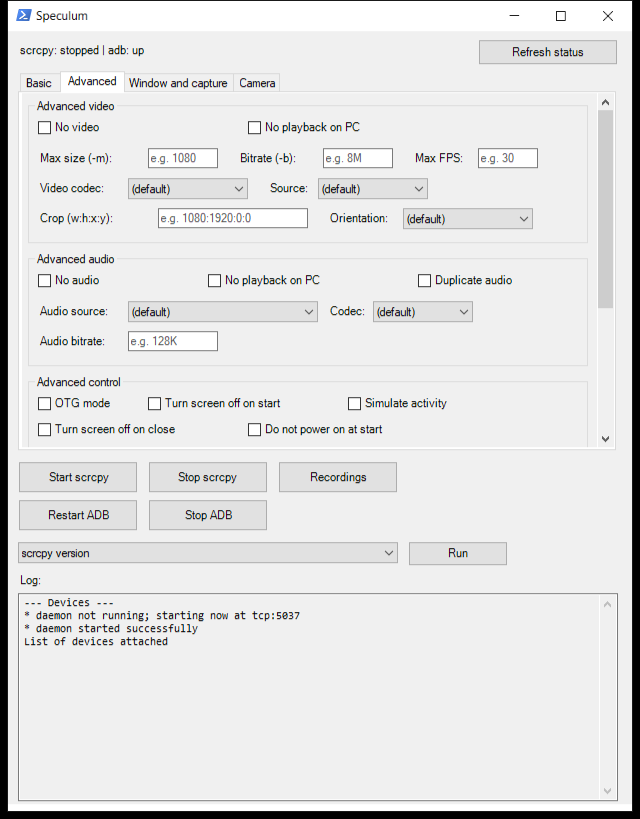
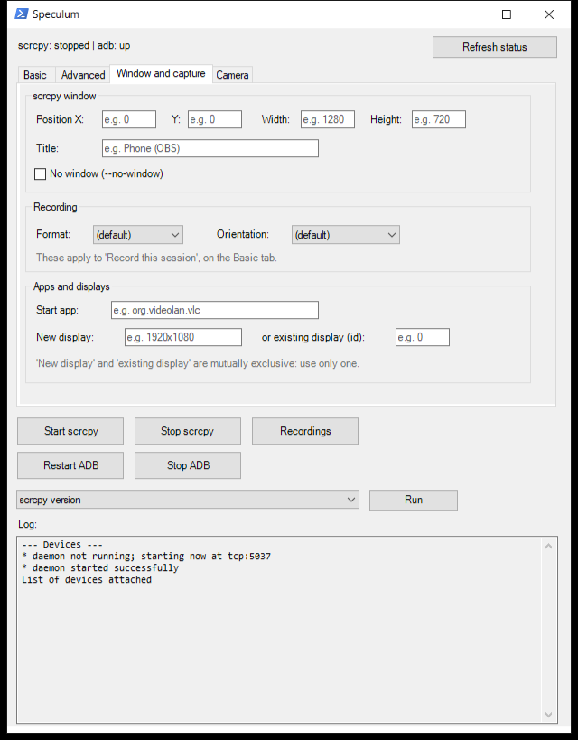
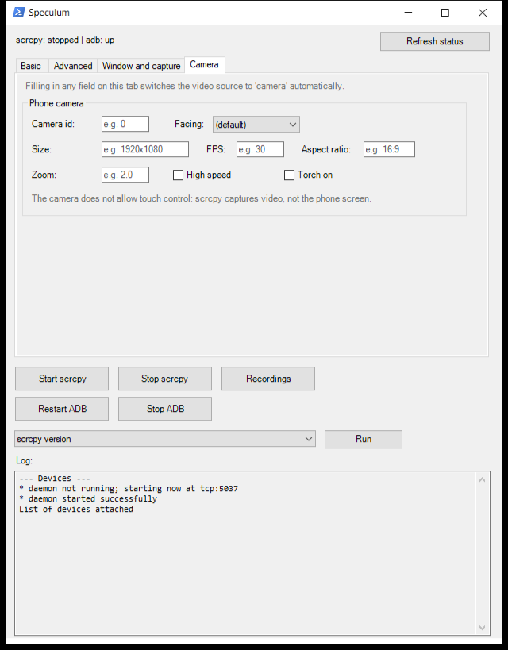

# Speculum

*Speculum*, Latin for mirror.

A graphical interface for Windows that wraps [scrcpy](https://github.com/Genymobile/scrcpy)
(Android screen mirroring and control over USB or WiFi), so you do not depend on the
terminal or have to remember command line flags.




## Requirements

- Windows 10/11.
- [scrcpy](https://github.com/Genymobile/scrcpy) installed, with `scrcpy.exe` and `adb.exe`
  reachable from the system PATH. The simplest way:
  ```
  winget install Genymobile.scrcpy
  ```
- An Android phone with **USB debugging** enabled (Settings → Developer options → USB
  debugging). On some vendors (Xiaomi/HyperOS, MIUI…) you also need to enable **"USB
  debugging (security settings)"** to be able to control the phone, not just see it.

Nothing else needs installing — `Speculum.exe` has no dependencies of its own beyond .NET
Framework, which already ships with Windows.

## Usage

Double click `Speculum.exe`. No installation and no administrator rights needed.

The repository holds the source code, not the binary. To get the `.exe`, download it from
the releases or build it yourself with a single command — see [Building from
source](#building-from-source), at the end.

### Basic tab

| Section | What it does |
|---|---|
| Launch mode | Normal, fullscreen, borderless (to capture in OBS), or read-only (you see the phone but do not control it) |
| Connection | Pick USB or WiFi, plus the **Pair over WiFi** button that runs the whole process automatically (needs the phone over USB the first time) |
| Options | Show touches on screen, keep the phone awake, record the session to an `.mp4` with an automatic timestamp |

Bottom buttons: **Start / Stop scrcpy**, **Restart / Stop ADB** (the server scrcpy uses to
talk to the phone), **Recordings** (opens the folder they are saved in), and a dropdown of
informational tools (version, encoders, cameras, camera sizes, displays and the apps
installed on the phone).

### Advanced tab

Every scrcpy option organised by category (Video, Audio, Control, Other), as checkboxes and
dropdowns — no flag to memorise. The text fields show an example inside them (e.g.
`e.g. 8M`) and an explanation on hover. A free field at the end lets you write any scrcpy
flag not covered by the interface, exactly as you would type it in a terminal.



### Window and capture tab

| Section | What it does |
|---|---|
| scrcpy window | Position, size and title of the window when it opens. Handy to keep it always in the same place and capture it in OBS without moving it every time. It can also open with no window at all, to record or to control over OTG |
| Recording | File format (`mp4`, `mkv`, and the audio-only ones) and rotation applied to the recording. They apply to **Record this session**, on the Basic tab |
| Apps and displays | Start an app on the phone when connecting, create a new virtual display, or mirror a specific display by its id |



### Camera tab

Uses the phone camera as the video source instead of its screen: this is what turns it into
a webcam. Pick the camera by id or by facing (front, back, external), and adjust
resolution, fps, aspect ratio, zoom, high speed mode and the torch.

Filling in any field on this tab switches the video source to `camera` automatically and
says so in the log — otherwise scrcpy would ignore those options without a word. To find
out which resolutions your phone supports, use **List camera sizes** in the tools dropdown.

There is no touch control with the camera: scrcpy captures video, not the phone screen.



## Connecting over WiFi

1. Connect the phone over USB once, with debugging enabled.
2. Press **Pair over WiFi** on the Basic tab. It finds the phone IP and connects on its own.
3. You can unplug the cable now. Next time the phone reboots you will have to repeat the
   process (adb's WiFi mode does not survive a reboot of the phone).

## Troubleshooting

- **WiFi pairing times out even though the phone and the PC are on the same network**:
  check whether you have a VPN running (Tailscale, etc.) that may be capturing the traffic
  towards your local network. Try it with the VPN disabled.
- **Stuttering video or audio dropouts over WiFi**: usually a weak WiFi signal rather than
  a scrcpy problem. If you are on a 5GHz network, try the 2.4GHz one (slower but longer
  range), or move closer to the router. You can also lower the bitrate/resolution on the
  Advanced tab so it copes better with a poor signal.
- **You can see the screen but cannot touch anything**: on Xiaomi/HyperOS/MIUI phones,
  enable "USB debugging (security settings)" in Developer options as well as plain USB
  debugging.
- **adb will not stay stopped**: that is normal. adb restarts its server automatically as
  soon as any action (including "Refresh status") uses it again.
- **adb stops when the launcher closes**: only if it was not running when you opened it. If
  it was already up (Android Studio, another terminal, another launcher window), the app
  leaves it alone on exit.

## Building from source

The only source file is `Speculum.cs` (C#, WinForms). It builds with the C# compiler that
already ships with Windows, with no need for Visual Studio or the .NET SDK:

```
C:\Windows\Microsoft.NET\Framework64\v4.0.30319\csc.exe /nologo /target:winexe /win32icon:speculum.ico /out:Speculum.exe /reference:System.Windows.Forms.dll /reference:System.Drawing.dll Speculum.cs
```

## Project status

See [`state.md`](state.md) for the history of design decisions, debugging context and open
items.
