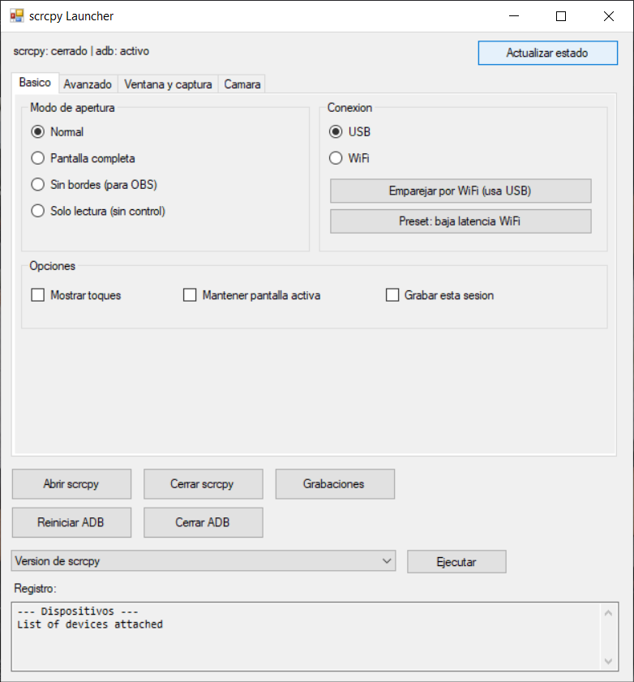
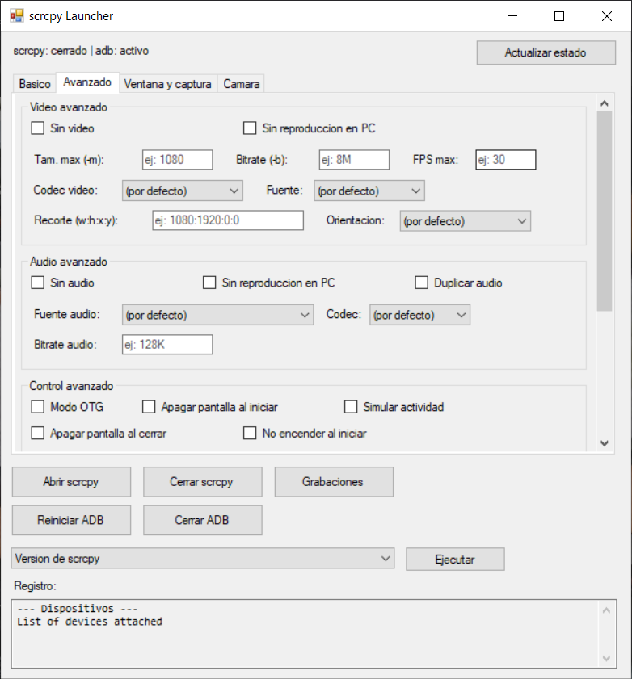
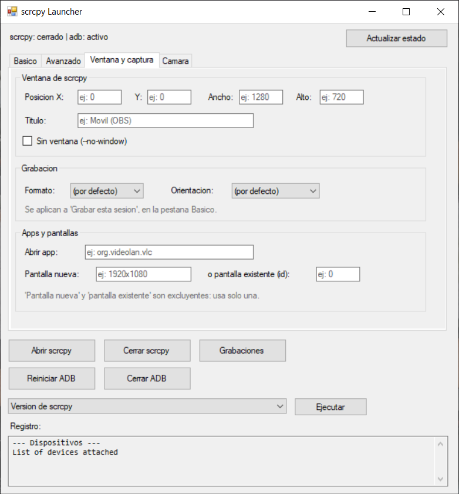
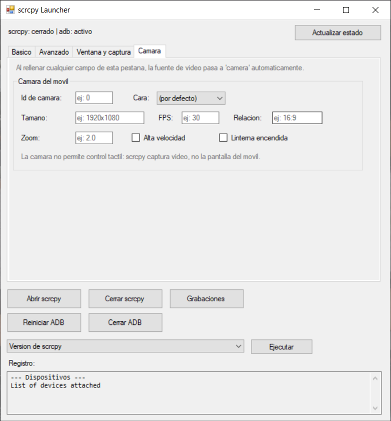

# scrcpy Launcher

Interfaz gráfica para Windows que envuelve [scrcpy](https://github.com/Genymobile/scrcpy)
(espejo y control de pantalla de Android por USB o WiFi), para no depender de la terminal
ni tener que recordar flags de la línea de comandos.




## Requisitos

- Windows 10/11.
- [scrcpy](https://github.com/Genymobile/scrcpy) instalado, con `scrcpy.exe` y `adb.exe`
  accesibles en el PATH del sistema. La forma más sencilla:
  ```
  winget install Genymobile.scrcpy
  ```
- Un móvil Android con la **depuración USB** activada (Ajustes → Opciones de
  desarrollador → Depuración USB). En algunos fabricantes (Xiaomi/HyperOS, MIUI…) hace
  falta activar además **"Depuración USB (ajustes de seguridad)"** para poder controlar el
  móvil, no solo verlo.

No hace falta instalar nada más — `ScrcpyLauncher.exe` no tiene dependencias propias más
allá de .NET Framework, que ya viene con Windows.

## Uso

Doble clic en `ScrcpyLauncher.exe`. No hace falta instalación ni permisos de administrador.

El repositorio contiene el código fuente, no el binario. Para obtener el `.exe`, descárgalo
de las releases o compílalo tú mismo con una sola orden — ver [Compilar desde el código
fuente](#compilar-desde-el-código-fuente), al final.

### Pestaña Básico

| Sección | Qué hace |
|---|---|
| Modo de apertura | Normal, pantalla completa, sin bordes (para capturar con OBS), o solo lectura (ves el móvil pero no lo controlas) |
| Conexión | Elegir USB o WiFi, y el botón **Emparejar por WiFi** que hace todo el proceso automático (requiere el móvil por USB la primera vez) |
| Opciones | Mostrar toques en pantalla, mantener el móvil despierto, grabar la sesión a un `.mp4` con fecha automática |

Botones inferiores: **Abrir / Cerrar scrcpy**, **Reiniciar / Cerrar ADB** (el servidor que
usa scrcpy para hablar con el móvil), **Grabaciones** (abre la carpeta donde se guardan), y
un desplegable de herramientas informativas (versión, codificadores, cámaras, tamaños de
cámara, pantallas y apps instaladas del móvil).

### Pestaña Avanzado

Todas las opciones de scrcpy organizadas por categoría (Video, Audio, Control, Otros),
como checkboxes y desplegables — no hace falta memorizar ningún flag. Los campos de texto
muestran un ejemplo dentro (p. ej. `ej: 8M`) y una explicación al pasar el ratón por
encima. Un campo libre al final permite escribir cualquier flag de scrcpy no representado
en la interfaz, tal cual se pondría en una terminal.



### Pestaña Ventana y captura

| Sección | Qué hace |
|---|---|
| Ventana de scrcpy | Posición, tamaño y título de la ventana al abrirse. Útil para dejarla siempre en el mismo sitio y capturarla con OBS sin recolocarla cada vez. También permite abrir sin ventana, para grabar o controlar por OTG |
| Grabación | Formato del archivo (`mp4`, `mkv`, y los de solo audio) y rotación aplicada a la grabación. Se aplican a **Grabar esta sesión**, de la pestaña Básico |
| Apps y pantallas | Abrir una app del móvil al conectar, crear una pantalla virtual nueva, o espejar una pantalla concreta por su id |



### Pestaña Cámara

Usa la cámara del móvil como fuente de vídeo en vez de su pantalla: sirve para emplearlo
como webcam. Se elige la cámara por id o por cara (frontal, trasera, externa), y se ajustan
resolución, fps, relación de aspecto, zoom, modo de alta velocidad y la linterna.

Al rellenar cualquier campo de esta pestaña, la fuente de vídeo pasa a `camera`
automáticamente y se avisa en el registro — de lo contrario scrcpy ignoraría esas opciones
sin decir nada. Para saber qué resoluciones admite tu móvil, usa **Listar tamaños de
cámara** en el desplegable de herramientas.

Con la cámara no hay control táctil: scrcpy captura vídeo, no la pantalla del móvil.



## Conectar por WiFi

1. Conecta el móvil por USB una vez, con la depuración activada.
2. Pulsa **Emparejar por WiFi** en la pestaña Básico. Detecta la IP del móvil y conecta
   solo.
3. Ya puedes desconectar el cable. La próxima vez que el móvil se reinicie, hará falta
   repetir el proceso (el modo WiFi de adb no sobrevive a un reinicio del teléfono).

## Solución de problemas

- **El emparejado por WiFi da timeout aunque el móvil y el PC estén en la misma red**:
  revisa si tienes alguna VPN activa (Tailscale, etc.) que pueda estar capturando el
  tráfico hacia tu red local. Pruébalo con la VPN desactivada.
- **Vídeo a tirones o cortes de audio por WiFi**: normalmente es señal WiFi débil, no un
  problema de scrcpy. Si estás en una red de 5GHz, prueba la de 2.4GHz (menos velocidad
  pero más alcance), o acércate al router. También puedes bajar el bitrate/resolución en
  la pestaña Avanzado para que tolere mejor una señal floja.
- **Se ve la pantalla pero no puedes tocar nada**: en móviles Xiaomi/HyperOS/MIUI, activa
  también "Depuración USB (ajustes de seguridad)" en Opciones de desarrollador, además de
  la depuración USB normal.
- **adb no se queda cerrado**: es normal. adb reinicia su servidor automáticamente en
  cuanto cualquier acción (incluida "Actualizar estado") vuelve a usarlo.

## Compilar desde el código fuente

El único archivo fuente es `ScrcpyLauncher.cs` (C#, WinForms). Se compila con el
compilador de C# que ya trae Windows, sin necesidad de Visual Studio ni el SDK de .NET:

```
C:\Windows\Microsoft.NET\Framework64\v4.0.30319\csc.exe /nologo /target:winexe /out:ScrcpyLauncher.exe /reference:System.Windows.Forms.dll /reference:System.Drawing.dll ScrcpyLauncher.cs
```

## Estado del proyecto

Ver [`state.md`](state.md) para el histórico de decisiones de diseño, contexto de
depuración y pendientes.
