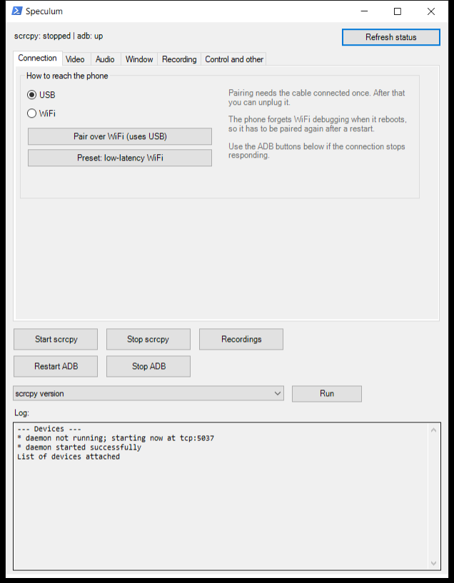
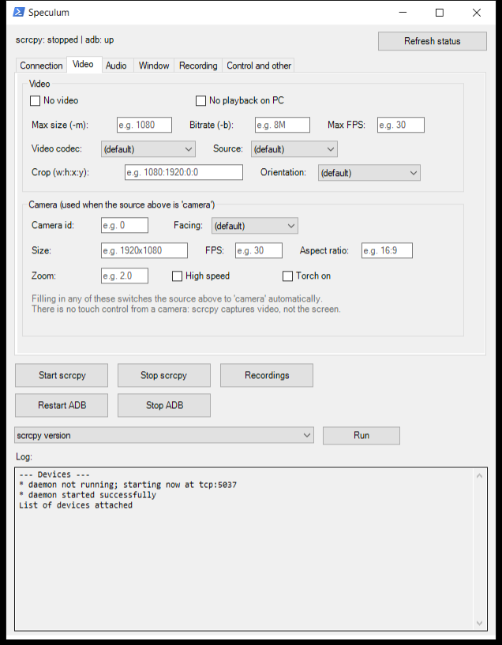
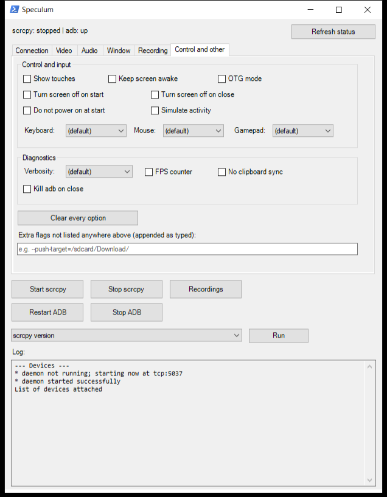

# Speculum

*Speculum*, Latin for mirror.

A graphical interface for Windows that wraps [scrcpy](https://github.com/Genymobile/scrcpy)
(Android screen mirroring and control over USB or WiFi), so you do not depend on the
terminal or have to remember command line flags.




## Requirements

- Windows 10/11.
- [scrcpy](https://github.com/Genymobile/scrcpy) installed, with `scrcpy.exe` and `adb.exe`
  reachable from the system PATH. The simplest way:
  ```
  winget install Genymobile.scrcpy
  ```
- An Android phone with **USB debugging** enabled (Settings → Developer options → USB
  debugging). On some vendors (Xiaomi/HyperOS, MIUI…) you also need to enable **"USB
  debugging (security settings)"** to be able to control the phone, not just see it.

Nothing else needs installing — `Speculum.exe` has no dependencies of its own beyond .NET
Framework, which already ships with Windows.

## Usage

Double click `Speculum.exe`. No installation and no administrator rights needed.

The repository holds the source code, not the binary. To get the `.exe`, download it from
the releases or build it yourself with a single command — see [Building from
source](#building-from-source), at the end.

The window has one tab per thing you configure, and the buttons you press every day sit
outside them, always visible: **Start / Stop scrcpy**, **Restart / Stop ADB** (the server
scrcpy uses to talk to the phone), **Recordings** (opens the folder they are saved in), and
a dropdown of informational tools (version, encoders, cameras, camera sizes, displays and
the apps installed on the phone). Launching a mirror never requires opening a tab at all.

Every text field shows an example inside it (e.g. `e.g. 8M`) and a full explanation on
hover, so there is no flag to memorise.

### Connection

Whether to use the phone over USB or over the network, the **Pair over WiFi** button that
runs the whole pairing automatically, and a low-latency preset for a weak signal. The
preset fills in the fields on the Video tab rather than applying anything hidden — every
value it sets stays visible and editable.

### Video

Everything about the image: source (the phone screen or one of its cameras), codec, max
size, bitrate, max fps, crop and orientation.

The camera settings live on this tab, in a group under the source they depend on: id or
facing, resolution, fps, aspect ratio, zoom, high speed mode and the torch. Filling in any
of them switches the source to `camera` automatically and says so in the log — otherwise
scrcpy would ignore them without a word. To find out which resolutions your phone supports,
use **List camera sizes** in the tools dropdown. There is no touch control from a camera:
scrcpy captures video, not the screen.



### Audio

Source, codec and bitrate, or no audio at all. Audio can also be captured without playing
it back on the PC, which is what you want when recording.

### Window

How the mirror window opens — normal, fullscreen, borderless (to capture in OBS), or
read-only, where you see the phone but do not control it — plus its position, size and
title, which is what lets you leave it in the same place and select it by title in OBS
without moving it every time. It can also open with no window at all, for recording or for
OTG control.

The last group is what to show in it: start an app on the phone when connecting, create a
new virtual display, or mirror a specific display by its id.


### Recording

Record the session to a file, its format and rotation, and a time limit that stops the
session on its own. Files are named with the date and time and go to the `Recordings`
folder next to the `.exe`; the **Recordings** button opens it.

### Control and other

Input and screen behaviour: show touches, keep the screen awake or turn it off, OTG mode,
and how keyboard, mouse and gamepad are sent to the phone. Then diagnostics — verbosity,
FPS counter, clipboard sync — a button that clears every option on every tab, and a free
field for any scrcpy flag not covered by the interface, typed exactly as you would in a
terminal.



## Connecting over WiFi

1. Connect the phone over USB once, with debugging enabled.
2. Press **Pair over WiFi** on the Connection tab. It finds the phone IP and connects on its own.
3. You can unplug the cable now. Next time the phone reboots you will have to repeat the
   process (adb's WiFi mode does not survive a reboot of the phone).

## Troubleshooting

- **WiFi pairing times out even though the phone and the PC are on the same network**:
  check whether you have a VPN running (Tailscale, etc.) that may be capturing the traffic
  towards your local network. Try it with the VPN disabled.
- **Stuttering video or audio dropouts over WiFi**: usually a weak WiFi signal rather than
  a scrcpy problem. If you are on a 5GHz network, try the 2.4GHz one (slower but longer
  range), or move closer to the router. You can also lower the bitrate/resolution on the
  Video tab so it copes better with a poor signal.
- **You can see the screen but cannot touch anything**: on Xiaomi/HyperOS/MIUI phones,
  enable "USB debugging (security settings)" in Developer options as well as plain USB
  debugging.
- **adb will not stay stopped**: that is normal. adb restarts its server automatically as
  soon as any action (including "Refresh status") uses it again.
- **adb stops when the launcher closes**: only if it was not running when you opened it. If
  it was already up (Android Studio, another terminal, another launcher window), the app
  leaves it alone on exit.

## Building from source

The only source file is `Speculum.cs` (C#, WinForms). It builds with the C# compiler that
already ships with Windows, with no need for Visual Studio or the .NET SDK:

```
C:\Windows\Microsoft.NET\Framework64\v4.0.30319\csc.exe /nologo /target:winexe /win32icon:speculum.ico /out:Speculum.exe /reference:System.Windows.Forms.dll /reference:System.Drawing.dll Speculum.cs
```

## Project status

See [`state.md`](state.md) for the history of design decisions, debugging context and open
items.
